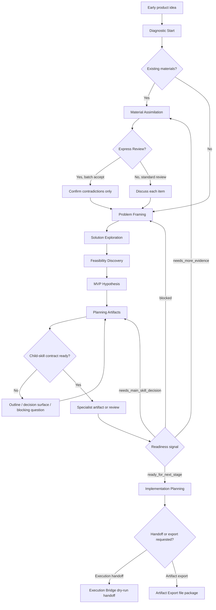

# Workflow Reference

Use this reference when the user wants to move beyond Diagnostic Start or when a stage boundary is unclear.

## Stage Purity

Each stage must focus on its own decision. Do not mix later-stage artifacts into earlier-stage exploration.

| Stage | Focus | Do Not Include |
|---|---|---|
| Diagnostic Start | Project state, materials, facts, assumptions, risks, candidate exploration directions | Users, scenarios, MVP, tech stack, PRD, Roadmap |
| Material Assimilation | Understand and challenge existing materials | Rewriting everything before understanding it |
| Problem Framing | Whether the problem is real and worth solving | Final MVP scope or implementation tasks |
| Solution Exploration | Product forms and solution strategies | Permanent architecture decisions |
| Feasibility Discovery | Technical, operational, platform, legal, and resource feasibility | Product positioning rewrites unless blocked |
| MVP Hypothesis | First testable slice | Permanent roadmap or full backlog |
| Planning Artifacts | Route grounded context to specialist child-skill contracts for PRD, Roadmap, Milestones, ADR, Decision Log, User Stories, Acceptance Criteria, Mermaid, Research Brief, Review | Coding or child-skill stage bypass |
| Implementation Planning | Decision-complete engineering plan after review-ready planning artifacts | Reopening product strategy unless contradiction blocks execution |

## Depth Modes

### Diagnostic Start

Default mode. Use for vague, early, or under-specified ideas.

Output only:

- Exploration mode notice.
- Zero-to-one judgment.
- Existing material judgment.
- Facts / assumptions / risks / unknowns.
- Two or three candidate exploration directions.
- Most dangerous assumption.
- One high-leverage trade-off question.

### Standard Exploration

Use when the user asks for fuller structure.

Add:

- Candidate problem definitions.
- Candidate solution directions.
- Initial trade-off table.
- Suggested next stage.

### Heavy Advisor

Use only when explicitly requested.

Add:

- Child-skill route outlines: PRD, Roadmap, Milestones, ADR / Decision Log, Research Brief, User Stories, documentation harness.
- Decision surfaces: unresolved decisions that must be aligned before implementation.
- Assumption clearings: explicit assumptions, unknowns, and risks that must not be treated as facts.
- Optional self-review from product, design, engineering, open-source, and architecture perspectives.

Always warn that this mode uses more context, takes longer, and can over-structure early assumptions.

When the product domain is under-specified, label leaf-level items as `[Assumption]`, `[Decision Surface]`, `[Candidate]`, or `[Unknown]`. Do not present complete PRD, Roadmap, Milestones, ADRs, implementation plans, or backlogs as final artifacts.

Heavy Advisor may simulate multiple child-skill contracts, but the main workflow still owns routing, downgrade, escalation, and the final alignment question.

For Heavy Advisor scoring, map:

- Fact / assumption / risk split to explicit assumptions, unknowns, and named risks.
- Candidate exploration directions to decision branches, ADR candidates, or option surfaces.
- Question quality to the leverage of the next alignment question, even if it asks for one-line domain context.

## Quick Mode

Quick Mode is an independent mode switch that can be activated at any stage. It is not a depth level like Diagnostic Start, Standard, or Heavy Advisor.

### When To Use

- User explicitly says "快速模式", "Quick Mode", "直接出 PRD", "直接给我 draft".
- System detects that the user has provided sufficient materials (complete PRD draft, detailed notes, competitor analysis, research data) and the user confirms.

### How It Works

1. Skip the interactive exploration loop (one-question-per-turn cycle).
2. Use the provided materials to extract facts, assumptions, decisions, risks, contradictions, and gaps.
3. Produce the requested artifact draft with evidence labels on every section.
4. End with an Evidence Gap Summary ordered by validation priority.

### Output Format

```markdown
# [Artifact Name] — Quick Mode Draft

## Section 1 [Fact]
Content grounded in user materials or confirmed evidence.

## Section 2 [Assumption]
Content based on unverified claims from materials or AI inference.

## Section 3 [Unknown]
Content that cannot be determined from available materials.

---

## Evidence Gap Summary

| Priority | Gap | Current Status | Suggested Validation |
|---|---|---|---|
| 1 | Target user persona | [Assumption] | User interview or survey |
| 2 | MVP scope boundary | [Unknown] | Stakeholder alignment meeting |
| 3 | Technical feasibility | [Fact] confirmed | — |
```

### Stage Behavior

- Quick Mode can jump from any stage directly to Planning Artifacts.
- Skipped stages are not "completed" — they are marked as "unverified" in the Evidence Gap Summary.
- The stage before Quick Mode activation is recorded for exit purposes.

### Evidence Assessment (Optional)

After receiving a Quick Mode draft, the user may say "给我一份 evidence assessment" to receive a standalone assessment table:

```markdown
## Evidence Assessment

| Dimension | Status | Explanation | Suggested Validation |
|---|---|---|---|
| Problem definition | ✅ Fact | Confirmed by user interviews | — |
| Target user | ⚠️ Assumption | Inferred from materials, not validated | User persona research |
| MVP scope | ❌ Unknown | Not addressed in materials | Stakeholder alignment |
```

This is optional. The user is not forced to read an assessment before seeing the draft.

### Restrictions

- Cannot produce unlabeled final artifacts. Every section must have `[Fact]`, `[Assumption]`, or `[Unknown]`.
- Cannot skip the Auditor's evidence check. Use simplified inline check instead of full Audit Report.
- Cannot be used for Implementation Planning. Implementation Planning requires review-ready planning artifacts.
- Cannot reopen product strategy decisions that were already accepted in a previous stage.

### Exit

To exit Quick Mode:

- Say "回到标准模式" or "回到探索". The workflow resumes from the stage before Quick Mode was activated.
- After reviewing a Quick Mode draft, the user may say "验证这个假设" to return to the specific exploration stage that addresses that assumption.

## Stage Flow



## Child-Skill Routing

During Planning Artifacts, use `planning-artifacts.md` to decide the route and `artifact-adapters.md` to build the child-skill handoff.

When producer, controller, auditor, workbench, or audit-report behavior matters, also load `multi-agent-orchestration.md`. The multi-agent protocol does not replace stage gates; it defines how Controller Agent, Producer Agents, Auditor Agent, and Runtime Workbench cooperate without overloading the main workflow.

For Problem Framing, ADR Governance, and Context Handoff, use `child-skill-wrappers.md` after the main workflow confirms that the wrapper is the correct next step.

The main workflow must always decide:

- Whether final output is allowed.
- Whether to downgrade to outline or decision surface.
- Whether a Decision Log entry or ADR escalation is required.
- Whether the child output's readiness signal supports the next stage.
- Whether a Producer Agent output needs Audit Report or controller-documented review before acceptance.
- What one question, if any, should be asked next.

Default producer order is Research -> PRD -> Roadmap -> ADR qualification -> Implementation Plan -> Execution Bridge -> Artifact Export -> Revision Trace. Execution Bridge is available only after a review-ready Implementation Plan exists and a target execution format is requested. Artifact Export is available when the user asks "导出产物", "export artifacts", "生成交付文件", or "导出工作台"; it preserves stable file paths and marks unready artifacts as `NOT_READY` instead of inventing content. Revision Trace is available only after stable artifacts have been exported. Keep production stage-serial unless the task is a review-only pass over the same accepted workbench state.

## State Persistence

Persist the Runtime Workbench state to `.z2o-state/workbench.json` so that discovery work survives session interruptions.

### When To Save

Save on every:

- Stage transition (e.g., Diagnostic Start → Problem Framing).
- Substantial artifact acceptance or downgrade.
- Explicit user request ("save", "保存", "持久化").

Do not save on every question-and-answer turn; save only when the workflow state meaningfully changes.

Before writing, validate the workbench against `evals/workbench.schema.json` and verify that `evidence_snapshot.summary` is derived from `evidence_snapshot.items`. When the host can write files, use `scripts/persist_workbench.py` so invalid state cannot overwrite the last good workbench and writes happen through same-directory temp file plus atomic replace.

### What To Store

```json
{
  "version": "0.4.0-rc.4",
  "last_updated": "ISO-8601 timestamp",
  "workflow_state": {
    "current_stage": "stage name",
    "current_goal": "one-line goal",
    "allowed_output_mode": "outline | decision_surface | final",
    "depth_mode": "diagnostic | standard | heavy_advisor | quick",
    "quick_mode_entry_stage": "stage name when Quick Mode was activated, or null",
    "do_not_cross": "boundary description"
  },
  "evidence_snapshot": {
    "items": [
      {
        "id": "ev-001",
        "content": "evidence content",
        "type": "fact | assumption | unknown | risk",
        "validation_status": "verified | unverified | partially_validated",
        "validation_plan": {
          "experiment": "description of validation method",
          "success_criteria": "what confirms or invalidates",
          "timeline": "when to validate by",
          "status": "not_started | in_progress | validated | invalidated"
        },
        "source": "stage or material origin",
        "impact_if_wrong": "low | medium | high | critical",
        "impact_rationale": "one-line explanation of why this impact level",
        "risk_weighted_priority": 0.0
      }
    ],
    "summary": {
      "total": 0,
      "facts": 0,
      "assumptions": 0,
      "unknowns": 0,
      "risks": 0,
      "validated": 0,
      "maturity_percentage": 0,
      "maturity_level": "insufficient | partial | sufficient | strong",
      "critical_impact_items": 0,
      "high_impact_items": 0,
      "highest_risk_item_id": "ev-xxx or null"
    }
  },
  "artifact_status": {
    "research": "not_started | in_progress | ready_for_review | accepted",
    "prd": "not_started | in_progress | ready_for_review | accepted",
    "roadmap": "not_started | in_progress | ready_for_review | accepted",
    "adr": "not_started | in_progress | ready_for_review | accepted",
    "implementation_plan": "not_started | in_progress | ready_for_review | accepted"
  },
  "decision_log": [
    {
      "date": "ISO-8601",
      "decision": "what was decided",
      "rationale": "why",
      "status": "accepted | candidate | deferred"
    }
  ],
  "skipped_stages": []
}
```

### Schema Version Note

Version `0.4.0-rc.4` keeps the v0.4 workbench shape and adds atomic Workbench persistence plus evidence summary consistency checks. Version `0.4.0-rc.3` added bounded Revision Index / Revision Record schemas. Version `0.4.0-rc.2` added Artifact Manifest / Execution Handoff release-check schemas. Version `0.4.0-rc.1` added release-check schemas in `evals/workbench.schema.json` and `evals/pattern-index.schema.json`. Version `0.4.0` introduced impact assessment (impact_if_wrong, impact_rationale, risk_weighted_priority) and risk summary counters. Version `0.3.0` introduced structured evidence items and summary counters. If a pre-0.3.0 `workbench.json` is found with the old flat-list format, treat it as a fresh start. If a 0.3.0 file is found without impact fields, the new fields default to null and risk_weighted_priority defaults to 0.0.

### Pattern Extraction

On completing Implementation Planning, extract discovery patterns from the current project and save to `.z2o-patterns/pattern-index.json`:

1. **Evidence patterns**: which evidence items were validated, which assumptions were confirmed/invalidated, evidence combinations that appeared frequently.
2. **Decision patterns**: which trade-offs were made, rationale used, decision patterns that repeat across stages.
3. **Stage gate patterns**: evidence maturity level at each stage transition, which inputs were on the critical path.

Pattern extraction is automatic on completion of Implementation Planning. Patterns are project-local runtime state (`.z2o-patterns/` directory) and do not enter the installable skill zip. The installable skill carries only `evals/pattern-index.schema.json`, not a live pattern index.

On starting a new project, check `.z2o-patterns/pattern-index.json` for matching patterns. If a match is found, offer the user the option to enrich the current discovery context. Pattern matching is advisory.

Each pattern entry in the index has this shape:

```json
{
  "id": "pattern-001",
  "project": "project name",
  "type": "evidence | decision | stage_gate",
  "description": "one-line description of the pattern",
  "metadata": {
    "evidence_items": ["item descriptions or types"],
    "stage": "stage where pattern was observed",
    "outcome": "what happened when this pattern was followed or ignored"
  },
  "created_at": "ISO-8601"
}
```

### What Not To Store

- Full artifact text (PRD body, Roadmap details, Implementation Plan tasks).
- Full conversation transcripts.
- Agent Work Orders or Agent Return Packets.
- Audit Reports.

### How To Resume

On new session start:

1. Check whether `.z2o-state/workbench.json` exists.
2. If it exists and `last_updated` is within 7 days, inform the user: "发现上次未完成的 discovery（stage: X，最后更新: Y）。继续还是重新开始？"
3. If the user says "继续", restore the workbench state and resume from `current_stage`.
4. If the user says "重新开始", ignore the persisted state and start with Diagnostic Start.
5. If `last_updated` is older than 7 days, mention the old state but default to starting fresh.

### Packaging Boundary

`.z2o-state/`, `.z2o-patterns/`, `z2o-artifacts/`, and `zero-to-one-product-discovery-eval-runs/` must be excluded from the installable skill zip. Users may choose to track runtime/export files in their own project `.gitignore` or version control, but they are project state and not part of the portable skill package.

## File Workbench Export

The File Workbench is the stable current-state view for day-to-day use. It is a dashboard/control surface, not an archive.

Show it inline when the user says "工作台" / "workbench" / "当前状态". Export it through Artifact Export when the user says "导出工作台".

Exported files:

```text
z2o-artifacts/<project-slug>/workbench/
├── workbench.md
├── workbench.json
├── evidence-dashboard.md
├── risk-map.md
└── readiness-spectrum.md
```

Required workbench sections:

1. Workflow state.
2. Next controller action.
3. Evidence maturity.
4. Risk map.
5. Readiness spectrum.
6. Artifact status.
7. Audit queue.
8. Blockers.
9. Skipped stages.

Workbench export may include artifact path references and concise summaries only. It must not include full transcripts, full artifact bodies, complete Agent Work Orders, complete Agent Return Packets, complete Audit Reports, or long history.

## Artifact Export

Route Artifact Export when the user says "导出产物", "export artifacts", "生成交付文件", or "导出工作台".

Default output root:

```text
z2o-artifacts/<project-slug>/
```

Stable file structure:

```text
manifest.json
README.md
prd.md
roadmap.md
user-stories.md
implementation-plan.md
workbench/workbench.md
workbench/workbench.json
workbench/evidence-dashboard.md
workbench/risk-map.md
workbench/readiness-spectrum.md
execution/github-issues.md
execution/github-issues.json
execution/github-issue-bodies/001-<task-slug>.md
execution/host-execution-checklist.md
revisions/revision-index.json
revisions/revision-log.md
revisions/records/rev-<timestamp>.json
revisions/diffs/rev-<timestamp>/<artifact>.diff
```

Missing or unready artifacts keep their fixed file path and contain only `NOT_READY`, artifact status, blocker, required input, and Controller decision. Do not invent PRD sections, roadmap phases, user stories, implementation tasks, GitHub issue bodies, or evidence to fill a stable file.

Each manifest artifact entry must include `source_status`, `content_mode`, and `status_guard`. If artifact status says `accepted` but the available content is only an outline, draft, or conflicted artifact, export `NOT_READY` or block with `status_guard: blocked_status_content_mismatch`.

If the exported content comes from Quick Mode and has not been validated after returning to Standard Exploration, the exported Markdown must start with `QUICK_MODE_DRAFT`, preserve `[Fact]` / `[Assumption]` / `[Unknown]` labels, and use `content_mode: quick_mode_draft` with `status_guard: quick_mode_banner_required`.

## Revision Trace

Route Revision Trace when the user says "生成 revision trace", "artifact diff", "产物变更记录", or "产物版本记录".

Revision Trace is a bounded artifact ledger outside Runtime Workbench. It compares stable artifact files only:

- `prd.md`
- `roadmap.md`
- `user-stories.md`
- `implementation-plan.md`

Output lives under:

```text
z2o-artifacts/<project-slug>/revisions/
├── revision-index.json
├── revision-log.md
├── records/
│   └── rev-<timestamp>.json
└── diffs/
    └── rev-<timestamp>/
        └── <artifact>.diff
```

Allowed record fields are artifact hashes, changed artifact list, mechanical Markdown heading summary, unified diff paths, Controller decision, Controller-supplied change reason, evidence refs, decision refs, and audit refs. If Controller metadata is missing, set `change_reason_status: missing`; do not infer semantic product rationale from text diffs.

Revision Trace must not:

- Store full transcripts, raw prompt history, hidden reasoning, full Agent Work Orders, full Agent Return Packets, full Audit Reports, or long discussion history.
- Put revision history into Workbench.
- Replace stable files with `prd-v1.md`, `prd-v2.md`, or `final-final.md`.
- Treat revision count as readiness, evidence maturity, or quality.
- Treat diffs as source of truth over Workbench, manifest, artifact status, Controller decision, or evidence refs.

## Evidence Maturity Dashboard

The Evidence Maturity Dashboard gives the user a real-time view of how much evidence has been verified, what assumptions remain unvalidated, and how far the project is from decision-readiness.

### When To Show

- User says "evidence dashboard" / "证据成熟度" / "evidence 状态" / "给我看 dashboard".
- On every stage transition, append a one-line summary (do not expand full dashboard): `[Evidence: X facts, Y assumptions, Z unknowns, W risks | Maturity: <level> (<percentage>%)]`

### Maturity Calculation

Only verified facts count as "mature":

```
maturity_percentage = verified_facts / total_evidence_items × 100
```

- `verified_facts` = items where type is `fact` AND validation_status is `verified`.
- `total_evidence_items` = all items regardless of type or validation status.
- `partially_validated` items count toward the denominator but not the numerator. They are not mature until fully verified.

### Risk-Weighted Priority Calculation

Each evidence item with `impact_if_wrong` gets a `risk_weighted_priority` score:

```
risk_weighted_priority = impact_score × (1 - confidence_score)
```

- `impact_score`: low=0.25, medium=0.5, high=0.75, critical=1.0
- `confidence_score`: derived from validation_status: verified=1.0, partially_validated=0.5, unverified=0.0
- Result: 0.0-1.0. Higher = should be validated first.

Items with `impact_if_wrong` of "critical" and `validation_status` of "unverified" get the highest priority (1.0) and should be validated before any other work proceeds.

Set `highest_risk_item_id` in the summary to the `id` of the evidence item with the highest `risk_weighted_priority`. Set to null if no items have `impact_if_wrong`.

Display with four-level labels to avoid number anxiety:

| Level | Range | Meaning |
|---|---|---|
| Insufficient | <25% | Evidence severely insufficient; cannot make key decisions |
| Partial | 25-50% | Some evidence in place; key assumptions still unverified |
| Sufficient | 50-75% | Most evidence in place; can make preliminary decisions |
| Strong | >75% | Evidence充分; can make key decisions |

Display format: `Evidence Maturity: Partial (42%)` — label for intuition, percentage for precision.

### Dashboard Output Format

```markdown
## Evidence Maturity Dashboard

### Overview
- Total evidence items: 12
- Verified facts: 5 (42%)
- Working assumptions: 4 (33%)
- Unknowns: 2 (17%)
- Risks: 1 (8%)
- **Evidence Maturity: Partial (42%)**

### Validation Progress
- Assumptions with validation plan: 2 / 4
- Assumptions validated this session: 1
- Unknowns resolved this session: 0

### Evidence by Stage
| Stage | Facts | Assumptions | Unknowns | Risks | Status |
|---|---|---|---|---|---|
| Diagnostic Start | 3 | 2 | 1 | 0 | Explored |
| Material Assimilation | 2 | 1 | 1 | 1 | In progress |
| Problem Framing | 0 | 1 | 0 | 0 | Not started |

### Top Priority Gaps
1. [Unknown] MVP scope boundary → Suggest: stakeholder alignment
2. [Assumption] Target user persona → Suggest: user interview (validation plan attached)
3. [Risk] Competitor timing → Suggest: market monitoring

### Assumptions Requiring Validation
| Assumption | Validation Plan | Status | Deadline |
|---|---|---|---|
| Target user is 25-35 | User persona research | Not started | Before PRD |
| Revenue model is subscription | Pricing experiment | Not started | Before Roadmap |

### Risk Map (按 risk_weighted_priority 降序)
| # | Assumption | Impact | Confidence | Risk Score | Validation Plan |
|---|---|---|---|---|---|
| 1 | Target user is 25-35 | Critical | Unverified | 1.00 | User persona research |
| 2 | Revenue model is subscription | High | Unverified | 0.75 | Pricing experiment |

### Recommended Validation Order
1. 先验证 #1（Critical + Unverified）→ User persona research
2. 再验证 #2（High + Unverified）→ Pricing experiment

### Readiness Spectrum (最近的 Planning Artifact)
- PRD Readiness: 63%
- Missing: user/scenario hypothesis (validated), success/failure indicators, non-goals
- Fastest path to PRD-ready: 3.5 天
```

### Data Source

The dashboard reads from the `evidence_snapshot` field in the persisted workbench state (`.z2o-state/workbench.json`). Each evidence item has: id, content, type, validation_status, validation_plan, and source.

The "Evidence by Stage" table is generated by grouping items by their `source` field. When creating or updating an evidence item, set `source` to the stage name where the item was identified (e.g., "Diagnostic Start", "Material Assimilation", "Problem Framing"). This enables the dashboard to show per-stage evidence distribution.

### Restrictions

- The dashboard is a read-only view. It does not modify evidence state.
- The dashboard does not replace the one-question-per-turn rule. After showing the dashboard, the skill asks one highest-leverage question if needed.
- The dashboard does not count unverified assumptions as "mature" even if the user has accepted them.

## Context Resume Packet

End each substantial stage with a compact packet:

```markdown
## Context Resume Packet

### Current Stage

### Confirmed Decisions

### Working Assumptions

### Unresolved Questions

### Candidate Directions

### Excluded Directions

### Key Risks

### Verified Evidence

### Unverified Claims

### Linked Artifacts

### Assumption Validation Bindings
For each assumption with a validation plan:
| Assumption | Experiment | Success Criteria | Timeline | Status |

### Evidence Maturity Summary
Total: X | Facts: X | Assumptions: X | Unknowns: X | Risks: X | Maturity: <level> (<percentage>%)
```

## Questions

Ask one high-leverage question at a time. A good question changes the next decision, resolves a trade-off, or confirms an assumption that cannot be discovered from files, docs, or environment inspection.
