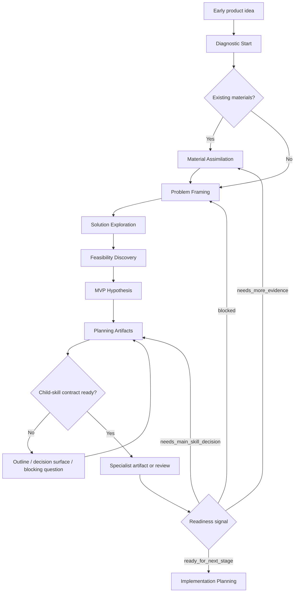

# Workflow Reference

Use this reference when the user wants to move beyond Diagnostic Start or when a stage boundary is unclear.

## Stage Purity

Each stage must focus on its own decision. Do not mix later-stage artifacts into earlier-stage exploration.

| Stage | Focus | Do Not Include |
|---|---|---|
| Diagnostic Start | Project state, materials, facts, assumptions, risks, candidate exploration directions | Users, scenarios, MVP, tech stack, PRD, Roadmap |
| Material Assimilation | Understand and challenge existing materials | Rewriting everything before understanding it |
| Problem Framing | Whether the problem is real and worth solving | Final MVP scope or implementation tasks |
| Solution Exploration | Product forms and solution strategies | Permanent architecture decisions |
| Feasibility Discovery | Technical, operational, platform, legal, and resource feasibility | Product positioning rewrites unless blocked |
| MVP Hypothesis | First testable slice | Permanent roadmap or full backlog |
| Planning Artifacts | Route grounded context to specialist child-skill contracts for PRD, Roadmap, Milestones, ADR, Decision Log, User Stories, Acceptance Criteria, Mermaid, Research Brief, Review | Coding or child-skill stage bypass |
| Implementation Planning | Decision-complete engineering plan after review-ready planning artifacts | Reopening product strategy unless contradiction blocks execution |

## Depth Modes

### Diagnostic Start

Default mode. Use for vague, early, or under-specified ideas.

Output only:

- Exploration mode notice.
- Zero-to-one judgment.
- Existing material judgment.
- Facts / assumptions / risks / unknowns.
- Two or three candidate exploration directions.
- Most dangerous assumption.
- One high-leverage trade-off question.

### Standard Exploration

Use when the user asks for fuller structure.

Add:

- Candidate problem definitions.
- Candidate solution directions.
- Initial trade-off table.
- Suggested next stage.

### Heavy Advisor

Use only when explicitly requested.

Add:

- Child-skill route outlines: PRD, Roadmap, Milestones, ADR / Decision Log, Research Brief, User Stories, documentation harness.
- Decision surfaces: unresolved decisions that must be aligned before implementation.
- Assumption clearings: explicit assumptions, unknowns, and risks that must not be treated as facts.
- Optional self-review from product, design, engineering, open-source, and architecture perspectives.

Always warn that this mode uses more context, takes longer, and can over-structure early assumptions.

When the product domain is under-specified, label leaf-level items as `[Assumption]`, `[Decision Surface]`, `[Candidate]`, or `[Unknown]`. Do not present complete PRD, Roadmap, Milestones, ADRs, implementation plans, or backlogs as final artifacts.

Heavy Advisor may simulate multiple child-skill contracts, but the main workflow still owns routing, downgrade, escalation, and the final alignment question.

For Heavy Advisor scoring, map:

- Fact / assumption / risk split to explicit assumptions, unknowns, and named risks.
- Candidate exploration directions to decision branches, ADR candidates, or option surfaces.
- Question quality to the leverage of the next alignment question, even if it asks for one-line domain context.

## Stage Flow



## Child-Skill Routing

During Planning Artifacts, use `planning-artifacts.md` to decide the route and `artifact-adapters.md` to build the child-skill handoff.

When producer, controller, auditor, workbench, or audit-report behavior matters, also load `multi-agent-orchestration.md`. The multi-agent protocol does not replace stage gates; it defines how Controller Agent, Producer Agents, Auditor Agent, and Runtime Workbench cooperate without overloading the main workflow.

For Problem Framing, ADR Governance, and Context Handoff, use `child-skill-wrappers.md` after the main workflow confirms that the wrapper is the correct next step.

The main workflow must always decide:

- Whether final output is allowed.
- Whether to downgrade to outline or decision surface.
- Whether a Decision Log entry or ADR escalation is required.
- Whether the child output's readiness signal supports the next stage.
- Whether a Producer Agent output needs Audit Report or controller-documented review before acceptance.
- What one question, if any, should be asked next.

Default producer order is Research -> PRD -> Roadmap -> ADR qualification -> Implementation Plan. Keep production stage-serial unless the task is a review-only pass over the same accepted workbench state.

## Context Resume Packet

End each substantial stage with a compact packet:

```markdown
## Context Resume Packet

### Current Stage

### Confirmed Decisions

### Working Assumptions

### Unresolved Questions

### Candidate Directions

### Excluded Directions

### Key Risks

### Verified Evidence

### Unverified Claims

### Linked Artifacts

### Recommended Next Action
```

## Questions

Ask one high-leverage question at a time. A good question changes the next decision, resolves a trade-off, or confirms an assumption that cannot be discovered from files, docs, or environment inspection.
